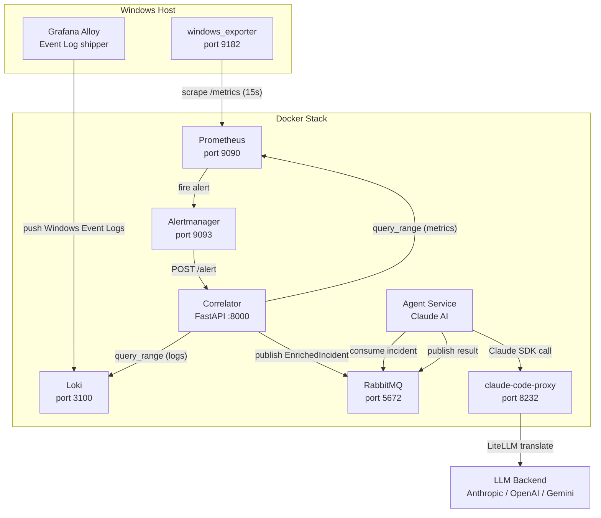
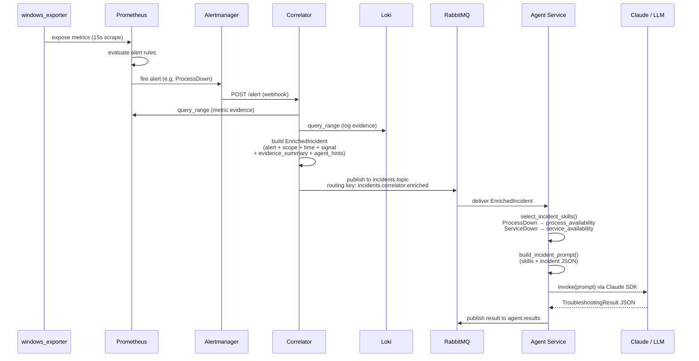
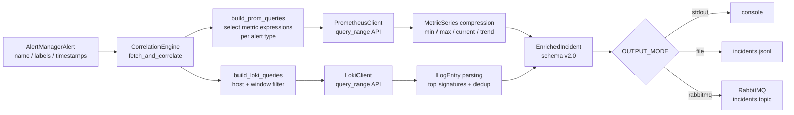
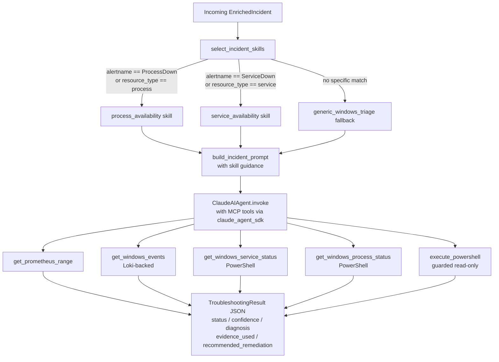

# Windows Troubleshooter

An AI-powered incident investigation pipeline for Windows hosts. The system monitors Windows metrics and logs, correlates fired alerts with telemetry evidence, and dispatches enriched incidents to a Claude-backed agent that diagnoses the root cause and recommends remediation.

## Table of Contents

- [Overview](#overview)
- [Prerequisites](#prerequisites)
- [Installation & Setup](#installation--setup)
- [Usage](#usage)
- [Architecture](#architecture)
- [Repository Structure](#repository-structure)
- [Configuration Reference](#configuration-reference)
- [Contributing](#contributing)

---

## Overview

**What it does**

1. Prometheus scrapes `windows_exporter` metrics (CPU, memory, disk, processes, services).
2. Alert rules fire when thresholds are breached (e.g. `ProcessDown`, `ServiceDown`, `HighCPU`).
3. Alertmanager delivers the alert to the **Correlator** – a FastAPI service that enriches each alert with Prometheus range data and Loki Windows Event Log evidence.
4. The Correlator publishes a compact, agent-oriented `EnrichedIncident` JSON to **RabbitMQ**.
5. The **Agent** service consumes that incident, selects the appropriate skill pack (e.g. `process_availability`, `service_availability`), and invokes a Claude model to investigate and produce a structured troubleshooting result.

**Key capabilities**

| Capability | Detail |
|---|---|
| Metric alerting | CPU, memory, disk, named processes, named services |
| Log ingestion | Windows Event Logs (System + Application) via Grafana Alloy → Loki |
| Alert correlation | Automatic enrichment with metric series and log evidence |
| AI investigation | Skill-routed prompt construction + Claude via `claude_agent_sdk` |
| MCP tools | `get_prometheus_range`, `get_windows_events`, `get_windows_service_status`, `get_windows_process_status`, `execute_powershell` (guarded read-only) |
| LLM backend flexibility | Optional `claude-code-proxy` to route requests to Gemini, OpenAI, or Anthropic |

**Intended users**

Windows platform engineers and SRE teams who want automated first-responder investigation of Windows host incidents without having to write custom runbooks for every alert.

---

## Prerequisites

### Infrastructure (runs in Docker)

| Requirement | Notes |
|---|---|
| Docker + Docker Compose v2+ | |
| `windows_exporter` | Installed on the monitored Windows host; listens on port `9182` |
| Grafana Alloy | Installed on the monitored Windows host; ships Event Logs to Loki |

### Agent service

| Requirement | Notes |
|---|---|
| Python 3.11+ | |
| `claude_agent_sdk` | See `agent/requirements.txt` |
| LLM API access | Anthropic / OpenAI / Gemini, or the bundled `claude-code-proxy` |

### Correlator service

| Requirement | Notes |
|---|---|
| Python 3.11+ | |
| Dependencies | See `correlator/requirements.txt` |

---

## Installation & Setup

### 1. Clone and configure environment variables

```powershell
git clone https://github.com/AymanGharib/windows-troubleshooter.git
cd windows-troubleshooter
```

Copy and edit the agent environment file:

```powershell
Copy-Item agent\.env.example agent\.env
notepad agent\.env
```

Set at minimum:

```dotenv
# agent/.env
AIPLATFORM_API_KEY=<your-api-key>
AIPLATFORM_BASE_URL=<claude-or-proxy-base-url>
MODEL=<model-name>
PROMETHEUS_BASE_URL=http://localhost:9090
LOKI_BASE_URL=http://localhost:3100
```

### 2. Start the infrastructure stack

From the repository root:

```powershell
docker compose up -d rabbitmq prometheus alertmanager loki
```

Services exposed:

| Service | Port |
|---|---|
| RabbitMQ AMQP | 5672 |
| RabbitMQ Management UI | 15672 |
| Prometheus | 9090 |
| Alertmanager | 9093 |
| Loki | 3100 |

### 3. Install `windows_exporter` on the Windows host

Download and run [windows_exporter](https://github.com/prometheus-community/windows_exporter) on the monitored host. It must listen on port `9182`.

### 4. Start Grafana Alloy on the Windows host

```powershell
powershell -ExecutionPolicy Bypass -File .\config\alloy\start-alloy-windows.ps1 `
    -AlloyExe 'C:\Program Files\GrafanaLabs\Alloy\alloy-windows-amd64.exe'
```

Verify Loki is receiving Windows Event Logs:

```powershell
powershell -ExecutionPolicy Bypass -File .\config\alloy\test-loki-windows-stream.ps1
```

### 5. Run the Correlator

```powershell
cd correlator
python -m venv .venv
.\.venv\Scripts\Activate.ps1
pip install -r requirements.txt
$env:OUTPUT_MODE = "rabbitmq"
uvicorn app.main:app --host 0.0.0.0 --port 8000 --reload
```

> **Tip:** Use `OUTPUT_MODE=file` with `OUTPUT_FILE_PATH=output/incidents.jsonl` during development to inspect enriched incidents without needing a live RabbitMQ connection.

### 6. Run the Agent

```powershell
cd agent
python -m venv .venv
.\.venv\Scripts\Activate.ps1
pip install -r requirements.txt
python -m app
```

Or start everything together with Docker Compose (includes the proxy):

```powershell
docker compose up -d proxy agent
```

---

## Usage

### Trigger a test alert (no Alertmanager required)

```powershell
cd correlator
powershell -ExecutionPolicy Bypass -File .\scripts\send-test-alert.ps1
```

This posts `correlator/testdata/sample-alert.json` directly to `POST /test/correlate` and prints (or files/publishes) the enriched incident.

### Generate per-process Prometheus alert rules

Add process names to `WATCHED_PROCESS_NAMES` in your environment, then:

```powershell
powershell -ExecutionPolicy Bypass -File .\config\prometheus\render-process-rules.ps1
```

This writes `config/prometheus/rules/generated-processes.yml`. Reload Prometheus to pick up the new rules.

### Enable debug output in the Correlator

```powershell
$env:DEBUG_INCLUDE_QUERY_OUTPUT = "true"
$env:DEBUG_MAX_CHARS_PER_PAYLOAD = "8000"
```

### Use the optional Claude Code Proxy

To route agent requests through an OpenAI or Gemini backend:

```powershell
Copy-Item claude-code-proxy\.env.example claude-code-proxy\.env
# Edit claude-code-proxy\.env and set PREFERRED_PROVIDER, API keys, etc.
docker compose up -d proxy
```

Then point the agent at the proxy:

```dotenv
# agent/.env
AIPLATFORM_BASE_URL=http://localhost:8232
```

### Log output modes

| `OUTPUT_MODE` value | Behaviour |
|---|---|
| `stdout` | Print each incident JSON to standard output |
| `file` | Append each incident as a JSON line to `OUTPUT_FILE_PATH` (default `output/incidents.jsonl`) |
| `rabbitmq` | Publish each incident to the configured RabbitMQ exchange |
| `noop` | Discard incidents (useful in testing) |

---

## Architecture

### High-level Component Diagram



### Main Execution Flow



### Data Flow: Alert to Enriched Incident



### Agent Skill Routing and Investigation



### Major Components

#### Monitoring Stack

- **`windows_exporter`** – Prometheus exporter installed on the Windows host. Exposes CPU, memory, disk, process, and service metrics on port `9182`.
- **Prometheus** – Scrapes `windows_exporter` every 15 seconds. Evaluates alert rules from `config/prometheus/rules/`.
- **Alertmanager** – Groups and routes fired alerts to the Correlator webhook at `http://host.docker.internal:8000/alert`.
- **Grafana Alloy** – Runs on the Windows host. Reads System and Application Windows Event Logs and ships them to Loki with labels `job=windows-eventlog`, `host=my-desktop`, `channel=System|Application`.
- **Loki** – Log aggregation backend. Stores windows-eventlog streams for the configured host.

#### Correlator (`correlator/`)

FastAPI service that acts as the Alertmanager webhook receiver and incident factory.

- **`engine.py` – `CorrelationEngine`** – Core logic. Given an `AlertManagerAlert`, it builds alert-type-specific Prometheus queries and Loki log queries, fetches evidence over the incident window, compresses metric series (min/max/current/trend), parses and deduplicates log entries, and assembles a compact `EnrichedIncident` (schema v2.0).
- **`models.py`** – Pydantic models for both input (AlertManager webhook format) and output (`EnrichedIncident` with sub-models: `AlertSummary`, `ScopeSummary`, `TimeSummary`, `SignalSummary`, `EvidenceSummary`, `AgentHints`).
- **`publisher.py`** – Pluggable output: stdout, JSONL file, RabbitMQ, or noop.
- **`main.py`** – FastAPI app with `POST /alert` (Alertmanager webhook) and `POST /test/correlate` (direct test endpoint).

#### Agent (`agent/`)

Python service that bridges RabbitMQ incidents to a Claude AI investigation.

- **`rabbitmq/consumer.py`** – Async `aio_pika` consumer. Declares the same `incidents.topic` exchange and `agent.incidents.tasks` queue as the correlator. Dispatches each message to `ClaudeAIAgent.invoke()` and publishes structured results back to `agent.results`.
- **`agent/claude_agent.py`** – Thin wrapper around `claude_agent_sdk`. Handles `invoke()` (single-shot) and `stream()` flows. Auto-connects the local MCP server before each call.
- **`agent/incident_skills.py`** – Skill registry with deterministic routing: `process_availability`, `service_availability`, `generic_windows_triage`. Each skill defines when to apply, investigation steps, tool usage guidance, and allowed tools.
- **`agent/incident_prompt_builder.py`** – Selects skills for the incident and builds the runtime user prompt (skills + incident JSON injected together).
- **`agent/result_schema.py`** – `TroubleshootingResult` Pydantic model (status, mode, summary, confidence, diagnosis, evidence_used, recommended_remediation).
- **`tools/`** – MCP tools auto-discovered at startup via `discover_local_mcp_tools()`. Each tool is decorated with `@tool` from `claude_agent_sdk`.
- **`config.py` – `AppConfig`** – Unified configuration access. Loads settings from typed environment variable classes. Discovers and assembles the local MCP server.

#### MCP Tools

| Tool | Implementation | Purpose |
|---|---|---|
| `get_prometheus_range` | `tools/prometheus_tools.py` | Query Prometheus range API for metric data during the incident window |
| `get_windows_events` | `tools/windows_event_tools.py` | Fetch Windows Event Log lines from Loki for a host and time range |
| `get_windows_service_status` | `tools/windows_service_tools.py` | Get live status of a Windows service via PowerShell `Get-CimInstance Win32_Service` |
| `get_windows_process_status` | `tools/windows_process_tools.py` | Get live status of a Windows process via PowerShell `Get-Process` |
| `execute_powershell` | `tools/powershell_tools.py` | Guarded read-only PowerShell execution with allowlist enforcement |

The `execute_powershell` tool enforces an allowlist of read-only command prefixes (`Get-`, `Test-`, `Resolve-`, etc.) and an explicit blocklist of write/destructive commands. The mode can be changed via `POWERSHELL_MODE=unsafe` but defaults to `readonly`.

#### Claude Code Proxy (`claude-code-proxy/`)

Optional FastAPI proxy that translates Anthropic API requests to OpenAI or Gemini format via LiteLLM. Use it to swap the LLM backend without changing the agent code.

---

## Repository Structure

```
windows-troubleshooter/
├── docker-compose.yml             # Infrastructure: RabbitMQ, Prometheus, Alertmanager, Loki, Agent, Proxy
├── .env                           # Root environment variables (shared by Compose services)
├── setup-winrm-https.ps1          # Helper: configure WinRM over HTTPS on the Windows host
├── context.md                     # Developer project context and design notes
│
├── config/
│   ├── prometheus/
│   │   ├── prometheus.yml             # Scrape config (targets windows_exporter at host.docker.internal:9182)
│   │   ├── rules/
│   │   │   ├── windows.yml            # Alert rules: HighCPU, HighMemory, LowDisk, ServiceDown
│   │   │   └── generated-processes.yml  # Auto-generated ProcessDown rules
│   │   └── render-process-rules.ps1   # Script to generate per-process alert rules
│   ├── alertmanager/
│   │   └── alertmanager.yml           # Routes all alerts to correlator webhook at :8000/alert
│   ├── loki/
│   │   └── local-config.yaml          # Loki storage config
│   ├── alloy/
│   │   ├── config.alloy               # Ships System + Application event logs to Loki
│   │   ├── start-alloy-windows.ps1    # Launch Alloy on the Windows host
│   │   └── test-loki-windows-stream.ps1  # Verify Loki ingestion
│   └── promtail/
│       ├── promtail-linux.yml         # Linux log shipping (Docker profile: linux-logs)
│       └── promtail-windows.yml       # Alternative Windows config (Alloy preferred)
│
├── correlator/                    # FastAPI alert correlation service
│   ├── app/
│   │   ├── main.py                # POST /alert, POST /test/correlate, GET /health
│   │   ├── engine.py              # CorrelationEngine: builds queries, fetches evidence, builds EnrichedIncident
│   │   ├── models.py              # Pydantic models: AlertManagerAlert, EnrichedIncident, sub-models
│   │   ├── clients.py             # PrometheusClient, LokiClient (async httpx)
│   │   ├── publisher.py           # StdoutPublisher, JsonlFilePublisher, RabbitMQPublisher, NoopPublisher
│   │   ├── rabbitmq_init.py       # Ensures correct RabbitMQ exchange/queue/binding topology
│   │   ├── config.py              # Settings via pydantic-settings
│   │   └── time_utils.py          # Alert window helpers (nanosecond timestamps)
│   ├── testdata/sample-alert.json # Sample Alertmanager payload for local testing
│   ├── scripts/send-test-alert.ps1  # Posts sample-alert.json to /test/correlate
│   ├── output/incidents.jsonl     # File output (when OUTPUT_MODE=file)
│   └── requirements.txt
│
├── agent/                         # AI incident investigation agent
│   ├── app/
│   │   ├── __main__.py            # Entry point: validates config, starts RabbitMQ consumer
│   │   ├── config.py              # AppConfig: unified settings access + MCP tool discovery
│   │   ├── agent/
│   │   │   ├── claude_agent.py          # ClaudeAIAgent: wraps claude_agent_sdk invoke()/stream()
│   │   │   ├── incident_prompt_builder.py  # build_incident_prompt(): selects skills, renders prompt
│   │   │   ├── incident_skills.py       # Skill registry: process_availability, service_availability, fallback
│   │   │   ├── result_schema.py         # Pydantic: TroubleshootingResult output schema
│   │   │   ├── agent_support.py         # build_claude_options, extract_final_text helpers
│   │   │   └── tool_callbacks.py        # Permission callbacks for tool execution
│   │   ├── rabbitmq/
│   │   │   ├── consumer.py        # Async consumer: receives incidents, invokes agent, publishes results
│   │   │   └── publisher.py       # Publishes agent results to agent.results queue
│   │   ├── tools/                 # MCP tools (auto-discovered at startup)
│   │   │   ├── prometheus_tools.py      # get_prometheus_range
│   │   │   ├── windows_event_tools.py   # get_windows_events (Loki-backed)
│   │   │   ├── windows_service_tools.py  # get_windows_service_status (PowerShell)
│   │   │   ├── windows_process_tools.py  # get_windows_process_status (PowerShell)
│   │   │   └── powershell_tools.py      # execute_powershell (guarded allowlist)
│   │   ├── a2a_core/              # A2A protocol support (HTTP mode)
│   │   ├── configs/environment_vars/  # Typed settings classes per domain
│   │   ├── common/utils.py        # get_logger, dict_to_compact_json
│   │   └── prompts/
│   │       └── agent_system_prompt.txt  # System prompt: roles, rules, skill routing, output schema
│   ├── .env.example               # Template for agent environment variables
│   ├── Dockerfile
│   ├── requirements.txt
│   ├── README.md                  # Agent-specific documentation
│   └── AGENT_DESIGN.md            # Detailed agent design notes and roadmap
│
└── claude-code-proxy/             # Optional LLM API proxy (Anthropic -> Gemini / OpenAI)
    ├── server.py                  # FastAPI/LiteLLM proxy server
    ├── .env.example               # PREFERRED_PROVIDER, BIG_MODEL, SMALL_MODEL, API keys
    ├── Dockerfile
    └── README.md                  # Proxy-specific documentation
```

---

## Configuration Reference

### Correlator environment variables

| Variable | Default | Description |
|---|---|---|
| `PROMETHEUS_BASE_URL` | `http://localhost:9090` | Prometheus API base URL |
| `LOKI_BASE_URL` | `http://localhost:3100` | Loki API base URL |
| `WATCHED_PROCESS_REGEX` | `(?i)wordpad\|write` (alternation pipe) | Regex for process name matching in correlator queries |
| `WATCHED_PROCESS_NAMES` | _(empty)_ | Comma-separated process names for rule generation |
| `DEFAULT_LOOKBACK_SECONDS` | `300` | Evidence window duration |
| `MAX_LOGS_PER_EVENT` | `30` | Max log entries per incident |
| `MAX_METRIC_POINTS_PER_SERIES` | `120` | Max metric points per series |
| `OUTPUT_MODE` | `stdout` | `stdout`, `file`, `rabbitmq`, or `noop` |
| `OUTPUT_FILE_PATH` | `output/incidents.jsonl` | File path when `OUTPUT_MODE=file` |
| `DEBUG_INCLUDE_QUERY_OUTPUT` | `false` | Include raw query strings/responses in incidents |
| `DEBUG_MAX_CHARS_PER_PAYLOAD` | `4000` | Max chars for debug payload truncation |

### Agent environment variables

| Variable | Default | Description |
|---|---|---|
| `AIPLATFORM_API_KEY` | _(required)_ | API key for the LLM backend |
| `AIPLATFORM_BASE_URL` | _(required)_ | Base URL for the LLM API (or proxy) |
| `MODEL` | _(required)_ | Model name to use |
| `MODEL_TEMPERATURE` | `0.2` | Sampling temperature |
| `MODEL_MAX_TOKENS` | `1000` | Max tokens per response |
| `AGENT_ENABLE_LOCAL_MCP` | `true` | Enable auto-discovery of MCP tools |
| `AGENT_DEBUG` | `false` | Enable verbose agent logging |
| `PROMETHEUS_BASE_URL` | `http://localhost:9090` | Used by MCP tools for live metric queries |
| `LOKI_BASE_URL` | `http://localhost:3100` | Used by MCP tools for live log queries |
| `MONITORING_TIMEOUT` | `10` | HTTP timeout (seconds) for monitoring tool calls |
| `POWERSHELL_EXECUTABLE` | `powershell` | PowerShell binary name |
| `POWERSHELL_MODE` | `readonly` | `readonly` enforces allowlist; `unsafe` disables checks |
| `POWERSHELL_TIMEOUT` | `20` | Timeout (seconds) for PowerShell commands |
| `POWERSHELL_MAX_OUTPUT_CHARS` | `12000` | Max characters captured from PowerShell output |

### RabbitMQ topology

| Parameter | Value |
|---|---|
| Exchange | `incidents.topic` |
| Exchange type | `topic` |
| Incident queue | `agent.incidents.tasks` |
| Routing key | `incidents.correlator.enriched` |
| Result queue | `agent.results` |

---

## Contributing

### Development notes

- The pipeline is intentionally single-host for now. `host`, `job`, and `env` labels are hardcoded to `my-desktop`, `windows-desktop`, and `dev` in several configuration files. Update these to match your environment before scaling.
- The agent framework supports both RabbitMQ consumer mode (default, `python -m app`) and A2A HTTP mode (via `agent/app/a2a_core/`).
- MCP tools are auto-discovered: any module in `agent/app/tools/` that imports and uses `@tool` from `claude_agent_sdk` is automatically included in the local MCP server at startup.
- To add a new alert type skill, add a new `IncidentSkill` to `agent/app/agent/incident_skills.py` and update the `select_incident_skills()` routing logic.
- To add a new MCP tool, create a new file in `agent/app/tools/` decorated with `@tool`. No registration step is needed.

### Known gaps and planned work

- MCP remediation tools (restart service, start service) are planned but not yet implemented.
- PowerShell execution on remote hosts is not yet implemented; currently runs locally.
- Loki log relevance filtering needs further tuning for low-signal hits.
- Skill routing for `HighCPU`, `HighMemory`, and `LowDisk` incidents is not yet implemented (falls back to `generic_windows_triage`).

See [`agent/AGENT_DESIGN.md`](agent/AGENT_DESIGN.md) for the full design and recommended build order.
